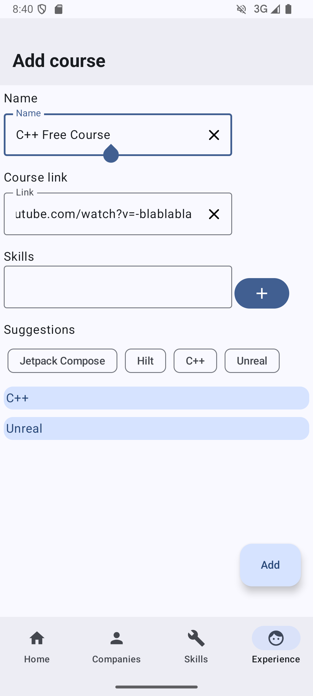
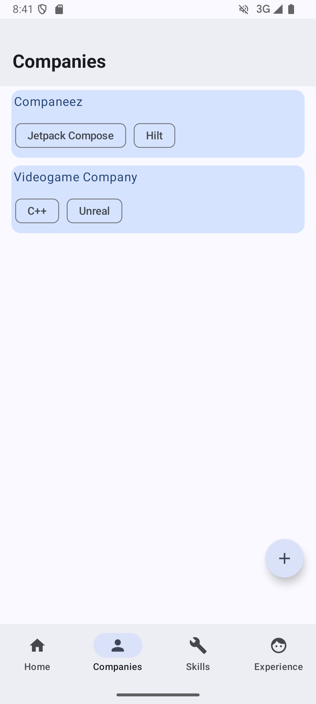
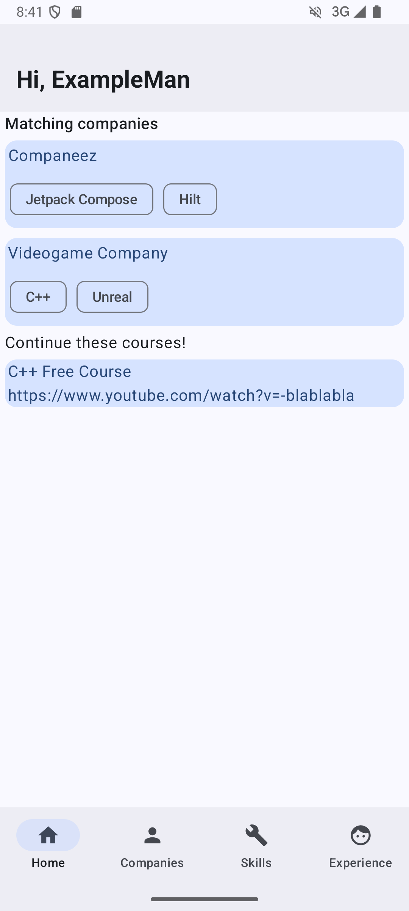

# An Android native application for keeping track of job applications

The goal of this app is to save job applications and resources to learn the skills required for them, so you can have a visual guide of what you should be studying for applying.

## Screenshots

  </img>
  </img>
  </img>
  </img>
</row>
